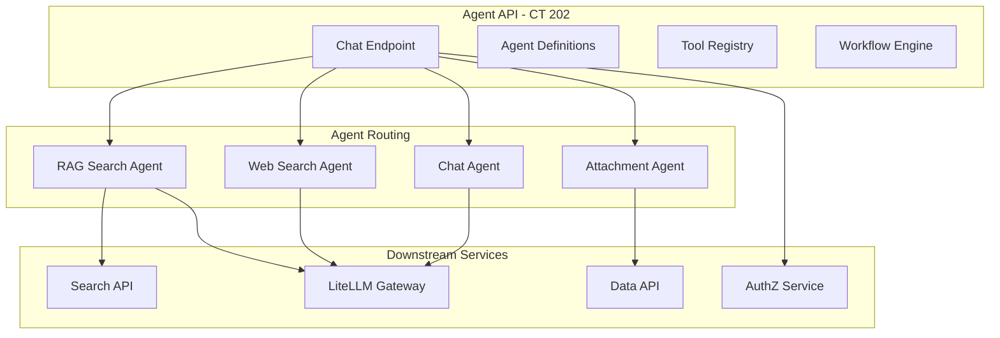

# Agent Service

**Created**: 2025-12-09  
**Last Updated**: 2026-02-12  
**Status**: Active  
**Category**: Architecture  
**Related Docs**:  
- `architecture/00-overview.md`  
- `architecture/02-ai.md`  
- `architecture/05-search.md`

## Service Placement
- **Container**: `agent-lxc` (CT 202)
- **Code**: `srv/agent`
- **Port**: 8000 (FastAPI)
- **Exposure**: Internal-only
- **Additional**: Docs API also runs on this container (port 8004)

## Agent Architecture



## Responsibilities
- Orchestrate agent-style requests (RAG + web + attachment decisions):
  - Accept user prompt, toggles (web/doc), attachments metadata.
  - Call Search API for retrieval (document-search tool).
  - Call liteLLM via OpenAI-compatible API for synthesis.
  - Enforce RBAC using the same JWT/role model as apps/search/ingest.
- Provide a stable surface for apps to invoke AI workflows without duplicating search/LLM calls.
- Manage agent definitions, conversations, workflows, and tools.

## Auth
- End-user JWT: RS256 tokens from AuthZ service (`iss=busibox-authz`, `aud=agent-api`).
- Token validation via JWKS from AuthZ service (`AUTHZ_JWKS_URL`).
- Token exchange: Agent service exchanges user tokens for service-specific tokens (e.g., `search-api`, `data-api`) via AuthZ token-exchange grant to call downstream services on behalf of the user.
- Scopes from JWT are stored in token grants for downstream calls.
- **Note**: OAuth2 scope-based operation authorization (e.g., `agent.execute`) is designed but not yet enforced. See `architecture/03-authentication.md` for current status.

## Built-in Agents (listed via `/admin/agents`)
- `rag-search-agent`: uses `document-search` tool; grounded answers with citations.
- `web-search-agent`: web search with configurable provider.
- `attachment-agent`: heuristic action/modelHint for attachments.
- `chat-agent`: final responder; uses provided doc/web/attachment context, avoids fabrication.

## Chat Endpoint
- **Path**: `POST /chat/message` (streaming: `POST /chat/message/stream`)
- **Behavior**: attachment decision -> optional doc search -> chat synthesis via liteLLM; streams tokens via SSE.
- **Inputs**: `content`, `enableDocumentSearch`, `enableWebSearch`, `attachmentIds?`, `model?`, `conversationId?`
- **Outputs**: streaming text + routing debug; doc results included in debug payload for UI display.

## Additional APIs (no `/api` prefix)
- `GET /agents` — list available agents
- `GET /conversations` — list conversations
- `POST /runs` — execute agent workflows
- `POST /runs/invoke` — synchronous agent invocation with optional structured output
- `GET /agents/tools` — list available tools
- `GET /admin/agents` — admin view of agent definitions

**Detailed docs**: [services/agents/](../services/agents/01-overview.md)

## Structured Output via `/runs/invoke`

For programmatic tasks that need deterministic JSON output (scoring, classification, summarization, data transformation), use the `/runs/invoke` endpoint with `response_schema`. This bypasses the chat system entirely and forces the LLM to produce schema-conforming JSON with validation and retry.

### How It Works

1. App calls `POST /runs/invoke` with `agent_name`, `input.prompt`, and `response_schema`
2. The agent runs with tools disabled and structured output enforced
3. The agent sends `response_format: { type: "json_schema", json_schema: <schema> }` to the LLM via LiteLLM
4. Response is validated against the schema with `jsonschema.validate()`; retries once on validation failure
5. The validated JSON is returned in `output`

### Schema Format

The `response_schema` follows the OpenAI structured output format:

```json
{
  "name": "my_output",
  "strict": true,
  "schema": {
    "type": "object",
    "additionalProperties": false,
    "required": ["items"],
    "properties": {
      "items": {
        "type": "array",
        "maxItems": 10,
        "items": {
          "type": "object",
          "additionalProperties": false,
          "properties": {
            "name": { "type": "string" },
            "score": { "type": "number" }
          },
          "required": ["name", "score"]
        }
      }
    }
  }
}
```

Key fields:
- `name` — identifier for logging (required)
- `strict` — enables strict schema enforcement (recommended)
- `schema` — the actual JSON Schema describing the output

### Which Agent to Use

Use the built-in `record-extractor` agent. It is a no-tool, deterministic agent designed for structured output tasks. It automatically:
- Prepends `/no_think` to suppress Qwen reasoning blocks
- Validates output against your schema
- Retries once on validation failure
- Extracts JSON from markdown fences or thinking blocks if needed

### Example: App API Route (TypeScript)

```typescript
const AGENT_API_URL = process.env.AGENT_API_URL || "http://localhost:8000";

const SCORE_SCHEMA = {
  name: "candidate_scores",
  strict: true,
  schema: {
    type: "object",
    additionalProperties: false,
    required: ["scores"],
    properties: {
      scores: {
        type: "array",
        maxItems: 10,
        items: {
          type: "object",
          additionalProperties: false,
          required: ["criterionId", "score", "reasoning"],
          properties: {
            criterionId: { type: "string" },
            score: { type: "number" },
            reasoning: { type: "string" },
          },
        },
      },
    },
  },
};

// Call from a Next.js API route
const res = await fetch(`${AGENT_API_URL}/runs/invoke`, {
  method: "POST",
  headers: {
    Authorization: `Bearer ${agentApiToken}`,
    "Content-Type": "application/json",
  },
  body: JSON.stringify({
    agent_name: "record-extractor",
    input: {
      prompt: `Score this candidate against the criteria:\n\n${candidateProfile}`,
    },
    response_schema: SCORE_SCHEMA,
    agent_tier: "complex",
  }),
});

const { output, error } = await res.json();
// output is validated JSON matching SCORE_SCHEMA.schema
```

### Agent Tiers

- `simple` — 30s timeout, 512MB memory (default)
- `complex` — 5min timeout, 2GB memory (use for longer prompts)
- `batch` — 30min timeout, 4GB memory (use for large batch processing)

### Common Mistakes

- **Do NOT use `/llm/completions`** for structured output — it's a raw LiteLLM passthrough with no schema enforcement, validation, or retry
- **Do NOT use `/chat/message`** for programmatic tasks — it has a 1000-char query limit and is designed for conversational interaction
- **Always include `additionalProperties: false`** in object schemas — without this, the LLM may add unexpected fields
- **Always include `required` arrays** — omitting them means the LLM can skip fields
- **Use `maxItems` on arrays** — prevents the LLM from generating unbounded lists

## Custom Agents

Apps can register custom agents via `POST /agents/definitions`. Custom agents are useful when you need specific system instructions or tool configurations.

```typescript
// Agent definition (e.g., in lib/my-agents.ts)
export const MY_AGENT = {
  name: "my-scoring-agent",
  display_name: "Scoring Agent",
  description: "Scores items against criteria",
  instructions: `You are an expert evaluator. When given items and criteria,
score each item objectively based on evidence provided.`,
  model: "agent",
  tools: { names: [] },
  workflows: { execution_mode: "run_once" },
};

// Seed via API (one-time setup)
await fetch(`${AGENT_API_URL}/agents/definitions`, {
  method: "POST",
  headers: {
    Authorization: `Bearer ${token}`,
    "Content-Type": "application/json",
  },
  body: JSON.stringify(MY_AGENT),
});

// Then invoke with structured output
await fetch(`${AGENT_API_URL}/runs/invoke`, {
  method: "POST",
  headers: { Authorization: `Bearer ${token}`, "Content-Type": "application/json" },
  body: JSON.stringify({
    agent_name: "my-scoring-agent",
    input: { prompt: "Score these candidates..." },
    response_schema: MY_SCHEMA,
    agent_tier: "complex",
  }),
});
```

## App Integration
- Apps exchange user session JWT for an `agent-api` audience token via AuthZ.
- Call `agent-api /api/chat` with the exchanged token, streaming the response to the UI.
- The `@jazzmind/busibox-app` library provides `AgentClient` and `SimpleChatInterface` for easy integration.
- For programmatic structured output, use `POST /runs/invoke` with `response_schema` (see above).

## Database
- Uses `agent` database in PostgreSQL.
- Schema managed via Alembic migrations (`srv/agent/alembic/`).
- Key tables: `agent_definitions`, `conversations`, `messages`, `tools`, `workflows`, `runs`, `run_outputs`, `run_tool_calls`.
