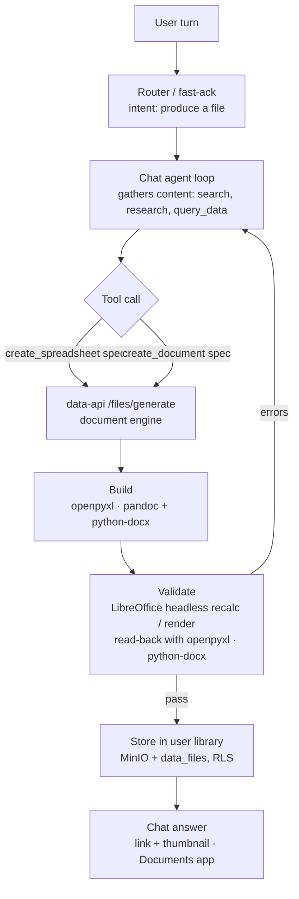

> **Status (2026-09-14):** Phases 1 and 2 are implemented on the
> `feat/chat-document-generation` work: engine in
> `srv/data/src/services/document_engine/`, routes in
> `srv/data/src/api/routes/generate.py`, shared specs in
> `busibox_common.document_specs`, agent tools in
> `srv/agent/app/tools/document_tools.py`, research auto-export in
> `research_orchestrator.py`, routing via the `document_generation` route and
> `document_intent_guard`, media proxy `?download=1` in busibox-frontend.
> Decisions taken: Excel + Word + research export; neutral built-in template;
> export on every consented research turn (`RESEARCH_EXPORT_DOCX`); generated
> files are indexed like uploads. Phase 3 (templates, `rows_from` data
> documents, PowerPoint) remains open. User guide: `docs/users/09-chat-files.md`.

# Chat Document Generation — Excel and Word from the AI Chat

Refines Pathway 2 of `chat-intelligence-roadmap.md` (items 2.2, 2.3, 2.5) and evaluates
the "Word + Excel Agent Harness" flowchart (generation → validation → repair loop,
2026-09-14). Item 2.1 (`analyze_document`) is unchanged and is a prerequisite for the
"edit this workbook" case, which this plan defers.

## Verdict on the harness flowchart

The shape is right: the model decides *what* to build, deterministic libraries build it,
a validator checks it, and the model only sees structured errors. That is exactly the
"no GUI" instinct — the LLM never drives Excel or Word, never writes Python, and every
failure is a cell address or a missing section, not a screenshot.

Four things should change before building it:

| Stage in the flowchart | Keep / change | Why |
|---|---|---|
| 2. "Agent defines document/workbook schema" | **Keep, make it typed.** The schema is a Pydantic spec the model emits as a tool call; the builder accepts nothing else. | Structured output is validated before any file exists. No free-form code, no sandbox. |
| 3. "XlsxWriter / openpyxl / **Aspose.Cells**" | **Drop Aspose.** openpyxl for Excel (write *and* read-back), pandoc + python-docx for Word. | Aspose is a paid, licensed .NET/Java product; it contradicts the self-hosted stack and adds nothing openpyxl + LibreOffice can't do here. |
| 4. "Save to temporary/output storage" | **Change: save straight into the user's library** via data-api. | One storage path, RLS applies, the file appears in the Documents app and is searchable. Temp storage would need its own lifecycle, auth and cleanup. |
| 5. "Render to PDF/PNG for layout QA; check clipping, overflow" (Word) | **Keep the render, drop the visual QA.** Render page 1 to PNG as a *thumbnail* for the chat; validate structure, not pixels. | Automated "does this look clipped" needs a vision model on every page — slow, costly, flaky. Structural checks (sections present, tables non-empty, page count in range) catch what matters. |
| 5. "Recalculate with Aspose or Excel API" (Excel) | **Change: LibreOffice headless** (`libreoffice-calc-nogui`) recalculates; openpyxl reads the values back. | Free, no GUI, the standard for this. Also the only way to store cached values so the Documents app and the ingest worker see numbers instead of empty formula cells. |
| ↺ Repair loop | **Keep, bound it.** Max two repair rounds; errors are cell/section addressed; deliver only when Excel has zero formula errors. | An unbounded loop is a token bill; a workbook with `#REF!` is worse than no workbook. |

One thing the flowchart doesn't address at all, and busibox must: **where the numbers
come from.** Most requests here are "make a spreadsheet of *these* results" — research
findings, `query_data` output, an attached file. If the model has to retype every figure
into the spec, that is the largest error source in the whole pipeline. The spec therefore
accepts *references* (a data-document id, a prior tool result) and the builder pulls rows
server-side.

## Target design



**Where the engine lives: data-api, not the agent.** The earlier roadmap said "no
LibreOffice in the agent" and that still holds. data-api already has python-docx,
openpyxl and reportlab, already owns file storage and the ingest pipeline, and is the
one container that should carry LibreOffice and pandoc. The agent gets two thin tools
that post a spec with the caller's data-api-scoped JWT (the same token path
`generate_image` and `render_chart` use — `BusiboxClient.token_for("data-api")`) and
receive `{file_id, download_url, thumbnail_url, validation}`.

Two new endpoints in `srv/data`:

- `POST /files/generate/xlsx` — body: `WorkbookSpec`; returns the stored file plus a
  validation report.
- `POST /files/generate/docx` — body: `DocumentSpec`; same.

Both run the build in a worker thread, validate, store through the existing upload path
with `metadata.source = "generated"`, and return within a few seconds for typical sizes.

## Excel

### Spec

The model produces this; nothing else reaches the builder.

```json
{
  "filename": "dredging-fleet-2027.xlsx",
  "sheets": [
    {
      "name": "Fleet",
      "columns": [
        {"header": "Operator", "width": 22},
        {"header": "Vessels", "type": "int"},
        {"header": "Share", "type": "percent", "format": "0.0%"}
      ],
      "rows": [["Boskalis", 80, null], ["Van Oord", 60, null]],
      "rows_from": null,
      "formulas": {"C2:C3": "=B{row}/SUM($B$2:$B$3)", "B5": "=SUM(B2:B3)"},
      "labels": {"A5": "Total"},
      "freeze": "A2",
      "autofilter": true,
      "validations": [{"range": "A2:A100", "list": ["Boskalis", "Van Oord", "DEME"]}],
      "conditional": [{"range": "C2:C3", "rule": "top", "n": 1, "fill": "C6EFCE"}],
      "named_ranges": {"FleetTotal": "Fleet!$B$5"},
      "chart": {"kind": "bar", "title": "Vessels by operator", "categories": "A2:A3", "values": "B2:B3", "anchor": "E2"}
    }
  ],
  "assertions": [
    {"cell": "Fleet!B5", "equals_sum_of": "Fleet!B2:B3"},
    {"cell": "Fleet!C2", "between": [0, 1]}
  ]
}
```

Notes on the contract:

- `formulas` are real Excel formula strings. `{row}` expands across a range. The
  builder writes them as formulas, never as values.
- `rows_from` takes `{"data_document_id": …, "select": [...]}` or
  `{"tool_result": "query_data#3"}` (the ordinal from `AgentContext.tool_calls`), so a
  20-row table from `query_data` is copied by the server, not retyped by the model.
- `assertions` are the "business rules" from the flowchart, declared by the model at
  spec time and checked after recalculation. They are the cheapest high-value check in
  the whole design: the model states what a total *should* be before it can see the file.
- `type` drives cell typing (`int`, `float`, `percent`, `date`, `text`) so numbers are
  numbers — no `'1,234'` strings that break `SUM`.

### Build

openpyxl only. Bold header row, widths, number formats, freeze panes, autofilter,
data-validation lists, conditional formats, defined names, and native charts
(`openpyxl.chart` covers bar/line/pie/scatter, which is what research output needs).
XlsxWriter is not needed; it is write-only, and read-back is half the design.

### Validate

1. **Recalculate**: `soffice --headless --convert-to xlsx` into a temp dir. LibreOffice
   evaluates every formula and writes cached values.
2. **Read back** the converted copy with openpyxl (`data_only=True`) and scan every
   formula cell for `#REF!`, `#NAME?`, `#DIV/0!`, `#VALUE!`, `#N/A`. Each hit is
   reported as `Sheet!Cell: formula → error`.
3. **Structure**: every sheet, column, named range, validation range and chart from the
   spec exists in the file; formula ranges point inside the sheet's populated area.
4. **Assertions**: evaluate against the recalculated values; report expected vs actual.
5. **Deliver the recalculated copy** so cached values are present (the ingest worker
   reads `data_only=True`; without this step the library shows blank formula cells).
   Sanity-check that LibreOffice preserved the sheet list, dimensions, formulas and
   validations; if not, deliver the openpyxl original and say cached values are absent.

Formula functions that reach outside the workbook (`WEBSERVICE`, `HYPERLINK` to
external hosts, `RTD`, `DDE`) are rejected at spec validation.

### Repair loop

The tool returns `{success: false, errors: [...]}` with cell-addressed messages. The chat
loop (already loop-first for complex turns) lets the model edit the spec and call again.
Two rounds maximum; after that the tool returns the last error list and the answer tells
the user what was attempted and what failed. Excel is never delivered with formula
errors. Word is delivered with warnings (a missing optional section is not fatal).

## Word

### Two entry points, one builder

**`create_document(spec)`** for explicit requests ("write this up as a Word doc"):

```json
{
  "filename": "dredging-market-2027.docx",
  "template": "cashman-report",
  "title": "US Dredging Market Outlook 2027",
  "subtitle": "Deep research, 14 Sep 2026",
  "toc": true,
  "sections": [
    {"heading": "Bottom line", "markdown": "…"},
    {"heading": "Fleet", "markdown": "…table…", "images": [{"file_id": "…", "caption": "Vessels by operator", "width_in": 6}]}
  ],
  "sources": [{"title": "…", "url": "…"}]
}
```

**Deep research auto-export.** When a consented research turn completes, the
orchestrator calls the same builder with the lead's report as the body — headings,
tables and citations are already markdown, and the charts are already PNGs in the media
store (`render_chart` returns their file ids). No model call is involved; it costs a few
seconds and no tokens. The chat answer ends with the download link and a page-1
thumbnail. Controlled by `research_export_docx` (default on).

### Build

**pandoc** for the markdown-to-docx conversion, with `--reference-doc` pointing at a
Cashman template (`.docx` holding styles, header/footer, logo; stored in the repo under
`srv/data/templates/` and overridable per install). pandoc handles GFM tables, nested
lists, inline formatting, images, footnotes and `--toc` natively — the existing
line-by-line converter in `files.py` `export_file` handles none of these and should be
replaced by this path. **python-docx** post-processes what pandoc can't: cover-page
fields from the spec, page-number footer, a "Sources" section, and document properties.

Images referenced by `file_id` are fetched from data-api with the caller's token into
the build's temp dir before pandoc runs; pandoc runs with `--sandbox` so it cannot read
anything else.

### Validate

1. python-docx opens the file; every spec section heading is present in order; every
   spec table has ≥ 1 body row; every referenced image is embedded.
2. `soffice --headless --convert-to pdf` for page count (reported, and checked against
   an optional `max_pages`), and `pdftoppm -png -r 60 -f 1 -l 1` for the thumbnail,
   stored alongside the document as its own media file.
3. No pixel-level checks. If the template is right, the layout is right.

## Delivery in the chat

Today the chat renders markdown links and `` through the media proxy and nothing
else, so phase 1 needs no chat-app change beyond one query parameter:

- The answer ends with `[Download dredging-market-2027.docx](…/api/media/{id}?download=1)`
  and, for Word, ``.
- The media proxy hard-codes `Content-Disposition: inline`; add `?download=1` →
  `attachment; filename="<original name>"`. Without it Office files still download,
  but as the raw file id.
- The file is in the Documents app immediately (it went through the normal upload path
  and is indexed like any other document, so a later "what did that report say about
  Boskalis" works).

Phase 3 adds a `file` stream event and a file card in `Messages.tsx` (name, size,
download, open in Documents) — the "generated file chip" from the earlier roadmap.

## Security and cost

- **No code execution anywhere.** The spec is data; the builders are fixed code. This
  is the property that makes the design less error-prone than an LLM-writes-Python
  sandbox, and it is why Aspose/Excel automation and any "let the model script it"
  variant are out of scope.
- Zero-trust holds: the agent posts with the user's exchanged data-api JWT; the engine
  stores under that identity; no service credentials.
- Generation costs no tokens. The model spends output tokens on the spec — roughly the
  size of the data. Above a few thousand cells the spec should use `rows_from`; the
  builder also caps `rows` at 5,000 and sheets at 12.
- Container cost: `libreoffice-calc-nogui` + `libreoffice-writer-nogui` + `pandoc` +
  `poppler-utils` on the data container, roughly 400 MB. One-time, one container.

## Phases

**Phase 1 — Excel (working spreadsheets).** Engine skeleton in `srv/data`
(`src/services/document_engine/`), `WorkbookSpec`, openpyxl builder, LibreOffice
recalc + read-back validator, assertions, `/files/generate/xlsx`, `create_spreadsheet`
agent tool, `?download=1` on the media proxy, fast-ack few-shots for "make a
spreadsheet". *Acceptance:* "Create an Excel comparing Tavily vs Perplexity costs at
three volumes with a total row" opens in Excel with live, correct formulas; a
deliberately broken formula in a test spec is caught, reported by cell, and fixed on
the second round.

**Phase 2 — Word and research export.** `DocumentSpec`, pandoc + reference template,
python-docx post-processing, PDF page count + thumbnail, `/files/generate/docx`,
`create_document` tool, orchestrator auto-export, `research_export_docx` setting.
*Acceptance:* a deep-research turn ends with a downloadable .docx whose tables and charts
match the chat answer, with a TOC and numbered sources; the thumbnail shows in the chat.

**Phase 3 — Polish and reach.** `rows_from` references (data documents, prior tool
results), file card in the chat, `export_data_document` (any data document → .xlsx),
replace the `export_file` docx/pdf paths with the engine, retention/cleanup for
`source=generated`, and — only after `analyze_document` (roadmap 2.1) exists — editing
an attached workbook by round-tripping it through openpyxl with a diff-style spec.

## Testing

Unit tests for the builders run against fixture specs and assert on the produced files
with openpyxl / python-docx. Validator tests need LibreOffice, so the data-api test image
gets the same `-nogui` packages; a fixture spec with a `#REF!` formula must fail
validation and a fixed one must pass. `make test-docker SERVICE=data ARGS=tests/unit/test_document_engine.py`.

## Decisions to make before Phase 1

1. **Template**: is there a Cashman Word template (letterhead, styles) to use as the
   reference doc, or should the first version ship a neutral one?
2. **Research auto-export default**: on for every consented research turn (proposed), or
   only when the user asks for a document?
3. **Indexing generated files**: index them like uploads (proposed — makes reports
   searchable) or store with `skip_indexing` to keep the library lean?
